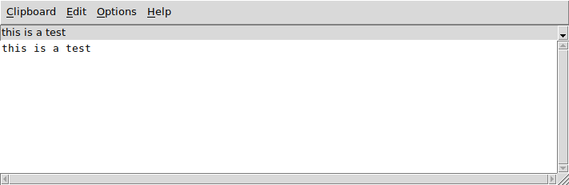

----

**tClip** is a simple clipboard manager written in core [Tcl/Tk](https://www.tcl.tk).

----

### Features

* On Top

* Tk Themes

* Editable Text

* Add custom Clips

* Command Line Support

* Runs in GNU/Linux, MS-Windows and Unix (MacOS not tested)

----

### Screenshot

----

### DEPENDENCIES

**Tcl** version 8.6 or later.

**Tk** version 8.6 or later.

##### For Microsoft Windows users:

[ActiveTcl](https://www.activestate.com/activetcl) version 8.6 or later.

----

### LICENSE

**tEdit** is licensed under the **MIT License**.

Read [LICENSE](LICENSE) for details.

----
