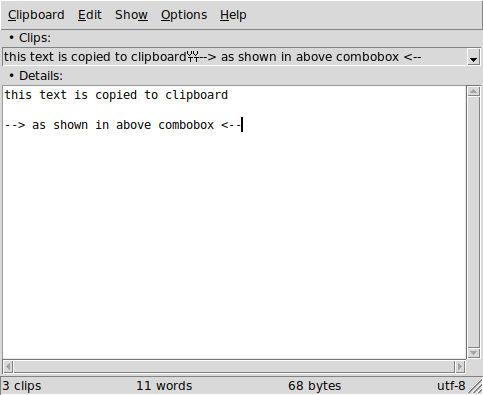

----

**tClip** is a simple clipboard manager written in core [Tcl/Tk](https://www.tcl.tk).

----

### Features

* On Top
* Tk Themes
* Editable Text
* Add custom Clips
* Command Line Support
* Auto or Manual read from Clipboard
* Runs in GNU/Linux, [Microsoft Windows](#for-microsoft-windows-users) and Unix (MacOS not tested)

----

### Screenshot

----

### Dependencies

**Tcl** version 8.6 or later.

**Tk** version 8.6 or later.

##### For Microsoft Windows users:

[ActiveTcl](https://www.activestate.com/activetcl) version 8.6 or later.

For executables go to [Releases](https://github.com/thanoulis/tclip/releases) section, or download the [latest](https://github.com/thanoulis/tclip/releases/latest/download/tclip.exe).

To run it, after download, right-click->Properties->Unblock.

----

### License

**tEdit** is licensed under the **MIT License**.

Read [LICENSE](LICENSE) for details.

----
